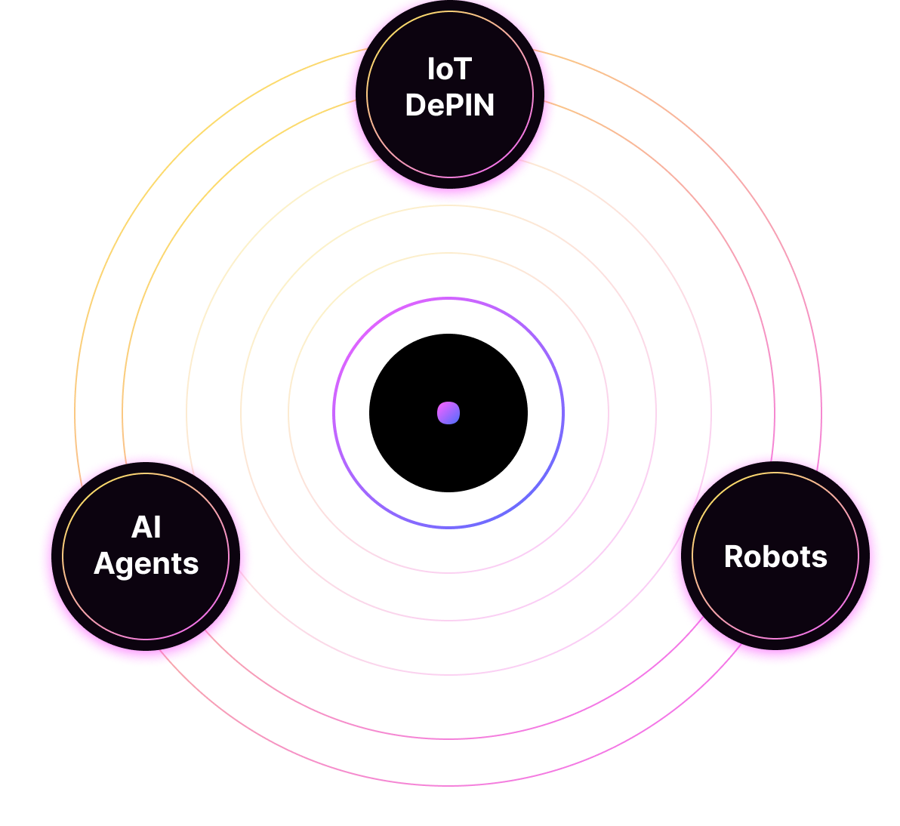
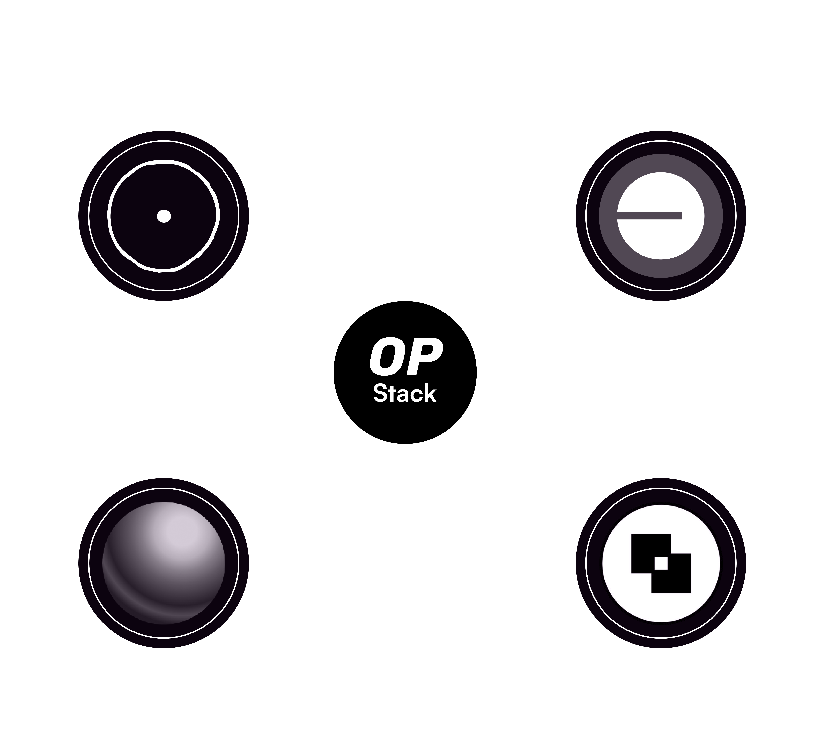

# 👋 Welcome to Stamp ⊙

<figure><figcaption></figcaption></figure>

## What is Stamp Network?

Stamp Network is an L2 blockchain focusing on supporting digital entities. It's an OP Chain relying on the robust security infrastructure of Ethereum. \
\
This network is set to reshape the interactions between Decentralized Physical Infrastructure (DePIN), autonomous agents, and humans as a facilitator in their coordination.

Stamp Network aspires to work as a bridge between bits and atoms. The more accurately we can map real-world actions, the more effectively we can coordinate incentives aiming to impact the world in a positive way.

<figure><figcaption></figcaption></figure>

## Stamp and the Superchain

This network is aligned with the proposal of **impact=profit** from the Optimism Collective.&#x20;

Stamp is embedding a sustainable mechanism within the machine economy to channel resources into developing open-source software for the Ethereum ecosystem, Stamp, and the broader community.

In this economy, where machines possess significant leverage, the Stamp Network emphasizes putting humans first, ensuring that the surge in technological advancement does not overshadow humanity’s essence and values. It serves as a catalyst, redistributing the accrued weight from the machine economy to the people.

This approach sees the awakening of Ether’s Phoenix, triumphing over Moloch and radiating transformative energy across the dimensions of technology and humanity.

<figure><figcaption></figcaption></figure>

## What is DePIN?

\
DePIN, or Decentralized Physical Infrastructure Networks, signifies a groundbreaking shift in how we approach real-world physical infrastructure through the lens of blockchain technology. Sovereignty becomes an integral part of this equation as DePIN empowers individuals, communities, and even emerging "network states" — decentralized entities that operate based on consensus mechanisms rather than traditional governmental structures — to take control of their infrastructure unhindered by centralized corporate monopolies.

Tokenization within DePIN not only encourages the deployment and management of these networks but also fosters sovereignty by giving participants direct ownership and stake in the infrastructure. This decentralized approach, combined with the rise of network states, offers a future where physical infrastructures are not just trustless and permissionless but also aligned with the broader values and desires of the communities they serve. This paradigm ensures that the benefits of the infrastructure, both economic and functional, are equitably distributed among its stakeholders.

## Use Cases

These are some of the use cases that fit the bill, and we are interested in supporting them with tooling and creating synergies among different projects. Reach out if you are building something in any of these areas or if you think your project could benefit from this type of solution:


[ai.md](use-cases/ai.md)



[infraesructure.md](use-cases/infraesructure.md)



[smart-cities.md](use-cases/smart-cities.md)



[automated-farms.md](use-cases/automated-farms.md)



[supply-chain.md](use-cases/supply-chain.md)

